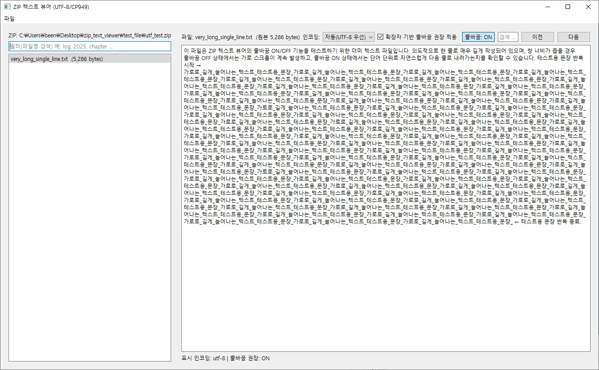

# ZIP Text Viewer

ZIP 파일을 **압축 해제하지 않고**,  
내부의 텍스트 파일을 바로 읽을 수 있는 **Windows GUI 도구**입니다.

로그 ZIP 파일을 열 때마다  
압축 해제 → 파일 탐색 → 텍스트 열기 → 다시 삭제  
이 반복이 번거로워서 시작한 개인 프로젝트입니다.

---

## ✨ Features

- ZIP 내부 텍스트 파일 **스트림 직접 읽기**
  - 임시 파일 생성 없음
- UTF-8 / CP949 인코딩 지원
  - UTF-8 우선 자동 판별 → 실패 시 CP949 fallback
  - 수동 인코딩 선택 가능
- 텍스트 검색
  - `Ctrl + F` 검색창
  - `Enter` / `Shift + Enter`로 다음·이전 검색
- 줄바꿈(Word Wrap) ON / OFF 토글
  - 문서 / 로그 파일 특성에 맞춘 UX 설계
- 공백 없는 긴 문자열 WordWrap edge case 해결
- Windows GUI (PySide6 기반)

---

## 🖼 Screenshots

> 이미지 파일은 `/assets/error_img` 디렉토리에 포함됩니다.

---

## 🛠 Tech Stack

- **Language**: Python  
- **GUI**: PySide6 (Qt)
- **Archive**: zipfile
- **Packaging**: PyInstaller

---

## 📦 Distribution

- **onefile exe**
  - 개인 실사용용
- **onedir 배포**
  - 포트폴리오 설명용
  - 의존성 구조 확인 가능

---

## 🔮 Future Work

- 7z 지원 (설계 완료)
- 다중 파일 탭
- 대용량 ZIP 파일 성능 최적화
- 코드 리팩토링 및 모듈화
